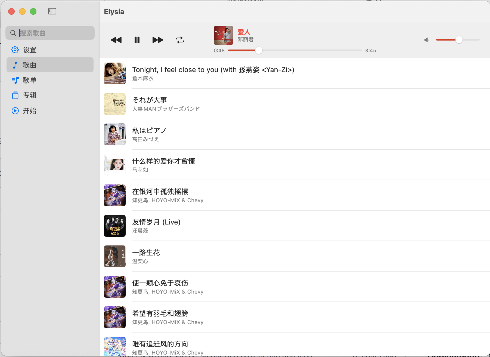
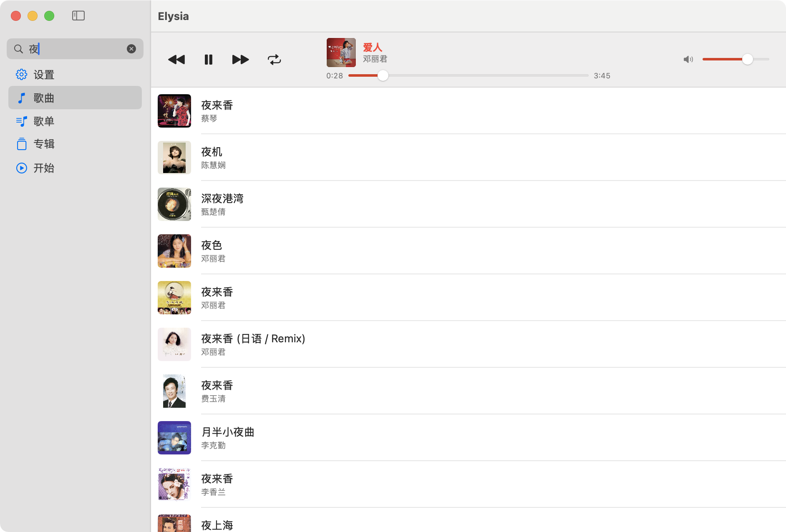
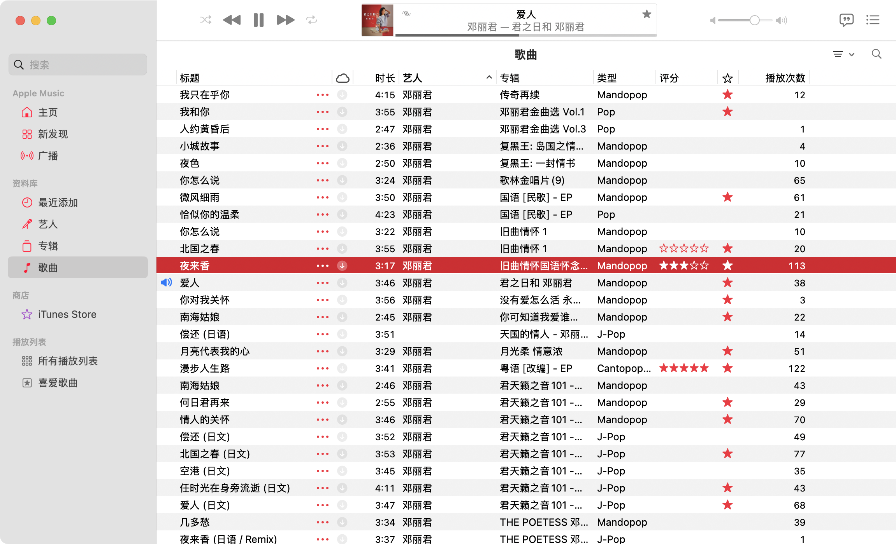
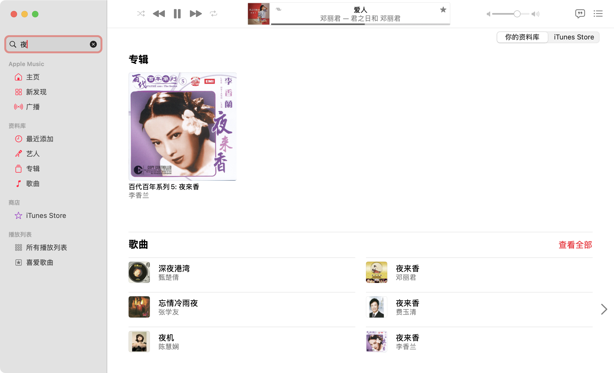

<div align="center">
    
    <h1>Elysia</h1>
</div>

# Elysia

The missing graphical interface of Apple Music

**English** · [简体中文](./README.zh-Hans.md)

## Official Website 
[elysia.macwave.org](https://elysia.macwave.org)  (Short link：[e.macwave.org](https://e.macwave.org))     

## Requirements

- macOS Ventura (13) or later
- Apple Music with a library (Elysia drives the Music app, it does not play audio itself)

## Languages

The interface ships in English and Simplified Chinese, as two independent
packs in `Elysia/en.lproj` and `Elysia/zh-Hans.lproj`. By default it follows the
system language; **Settings → Language** overrides it, which takes effect after
a restart.

## Why Elysia?

**1. A cleaner window.** i. Album artwork fills the left of every song row, so
tracks are easier to pick out. ii. The seldom-used sidebar sections (Radio,
iTunes) and the status columns (Genre, Rating, Plays) are gone.

**2. A tidier layout.** i. The artist sits under the song title, in grey and a
smaller size: easier to scan, and better looking. ii. The playing song's
artwork is outlined in red and its text turns bold red, with the progress and
volume sliders in red as well, so it is obvious at a glance.

**3. What Apple Music does not do.** Drag songs to change their order, and
restore the default order in one click.

## Comparison

**Elysia**

<p align="center">
  
</p>

<p align="center">
  
</p>

**Apple Music**

<p align="center">
  
</p>

<p align="center">
  
</p>

## Install

1. Download `Elysia-x.y.z.dmg` from the [website](https://elysia.com/downloads)
   or the [releases page](../../releases).
2. Open the DMG and drag **Elysia** onto the **Applications** shortcut.
3. Launch Elysia from Applications and allow it to control **Music** when macOS asks.

### If macOS refuses to open it

Released builds are signed but not notarized, which needs a paid Apple Developer
account. Gatekeeper therefore reports the app as coming from an unidentified
developer. Either workaround is fine:

- Right-click (or Control-click) Elysia in Applications, choose **Open**, then
  confirm. macOS remembers the choice.
- Or clear the download quarantine flag:

  ```sh
  xattr -dr com.apple.quarantine /Applications/Elysia.app
  ```

## Usage

**Play / pause** — double-click a song, or use the play/pause button.

**Reorder songs** — drag a song between the two songs you want it to sit
between, then let go.

**Change the repeat mode** — use the playback-mode button at the top
(off / repeat all / repeat one).

**Change the language or restore the default song order** — open **Settings**
in the sidebar and adjust it there.

## Build from source

The Xcode project is generated from `project.yml` with [XcodeGen](https://github.com/yonaskolb/XcodeGen),
so `Elysia.xcodeproj` is disposable:

```sh
xcodegen generate
open Elysia.xcodeproj
```

To produce a signed, universal (arm64 + x86_64) DMG in `dmg/`:

```sh
Scripts/package-dmg.sh
```

The script picks the first `Apple Development` identity in your keychain; set
`SIGN_IDENTITY` to override it, or to `-` for ad-hoc signing. It deliberately
leaves the hardened runtime off: enabling it would require the
`com.apple.security.automation.apple-events` entitlement to keep controlling
Music, and a personal team cannot notarize anyway.

### Looking at a packaged image

`Scripts/elysiadmgrun` mounts a packaged image and opens it in Finder, which is
the quickest way to check the install experience:

```sh
Scripts/elysiadmgrun              # newest image in dmg/
Scripts/elysiadmgrun path.dmg     # a specific image
Scripts/elysiadmgrun --eject      # eject it again
```

To have it as a command, link it somewhere on your `PATH`:

```sh
ln -s "$PWD/Scripts/elysiadmgrun" ~/.local/bin/elysiadmgrun
```

The app icon is regenerated from a single source image with
`Scripts/generate-appicon.py`.
